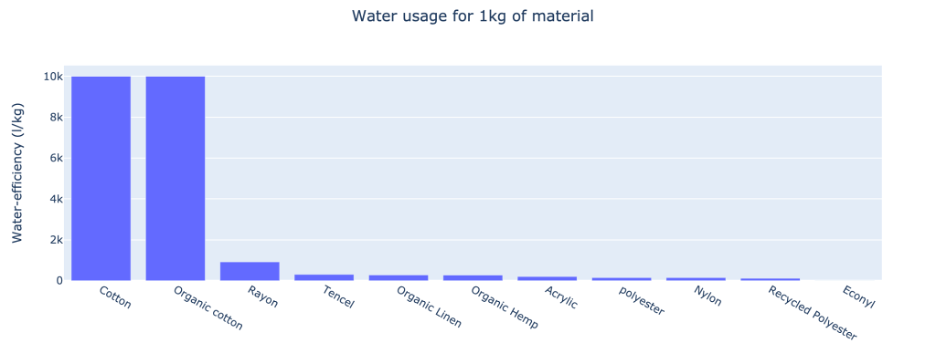
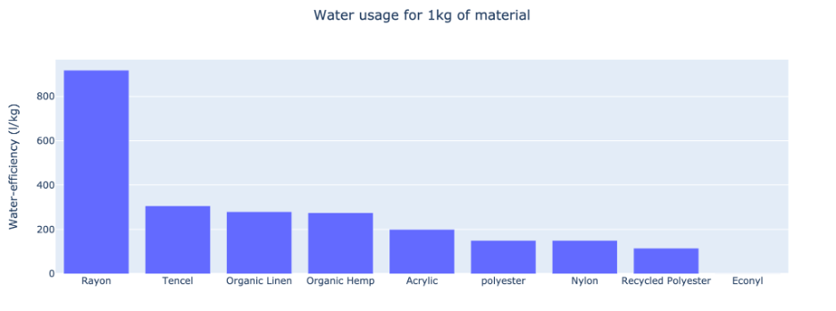

# Team Tada

We want to help reduce textile waste!

Why?

Because the fashion industry is the second-most polluting industry in the world! (Only behind oil)

We want to help consumers make more sustainable purchases.

It can be non-obvious what the right choice is. For example, cotton is biodegradable, but also requires a lot of water to produce!

Here is our initial data exploration of the water consumption for some materials:

Looking closer...

For more information, please take a look at our presentation: [Presentation](https://github.com/gridsusc/mindspark-1-team-tada/blob/main/Sustainable%20Shopper.pdf)

Here are the sources we have used to inform our sustainability scores:

1. [Water Usage for Materials](https://waterfootprint.org/media/downloads/WFA_Polyester_and__Viscose_2017.pdf)
2. [Water Consumption for Water](https://www.theworldcounts.com/challenges/consumption/clothing/cotton-farming-water-consumption/story)
3. [Guide to Sustainability Levels of Fabrics](https://www.eco-stylist.com/a-guide-to-the-most-and-least-sustainable-fabrics/)
4. [How long will a fabric take to decompose?](https://hellojackalo.com/blogs/news/fabric-decompose)
5. [Value chain sustainability](https://apparelcoalition.org/the-higg-index/)
6. [Higg Index](https://www.kymo.de/en/blog/how-sustainable-are-textiles-a-comparison-using-the-higg-material-index)

